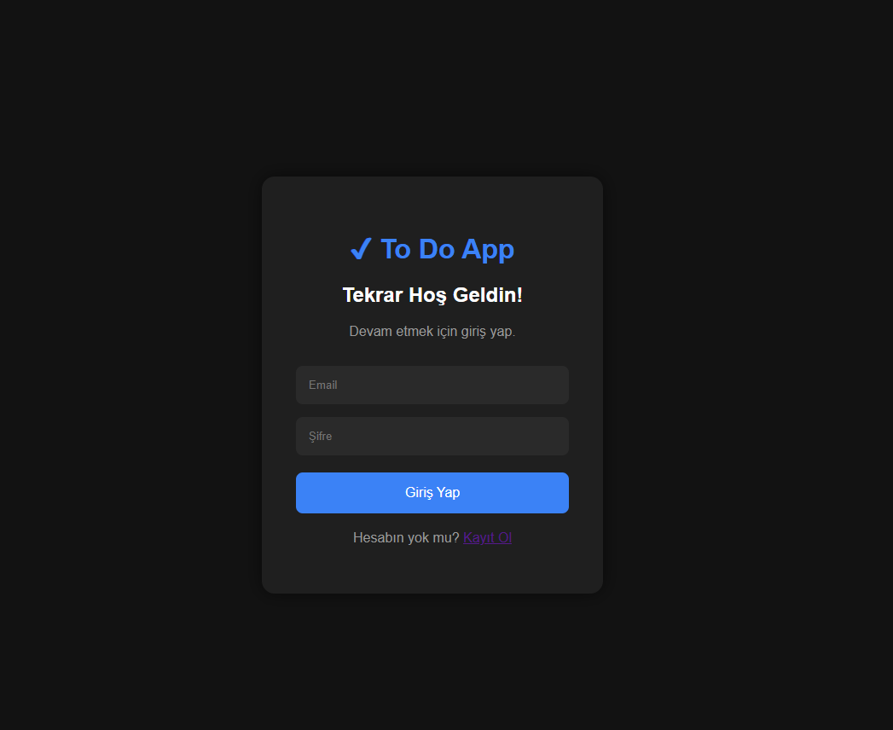
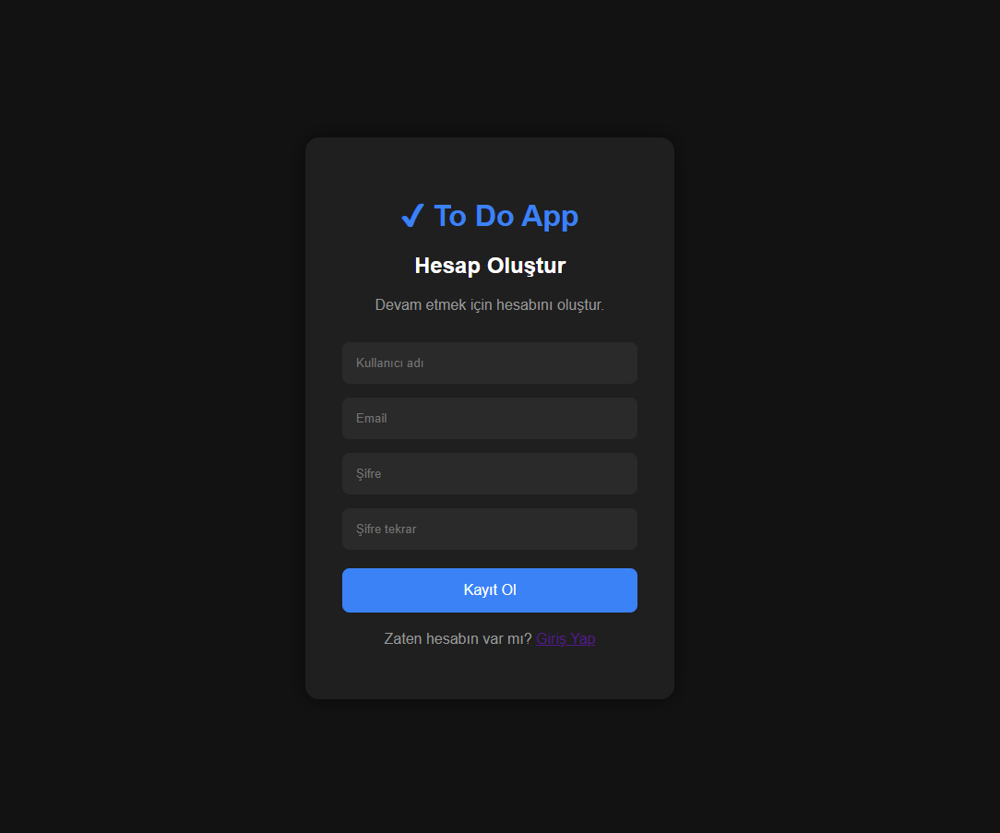
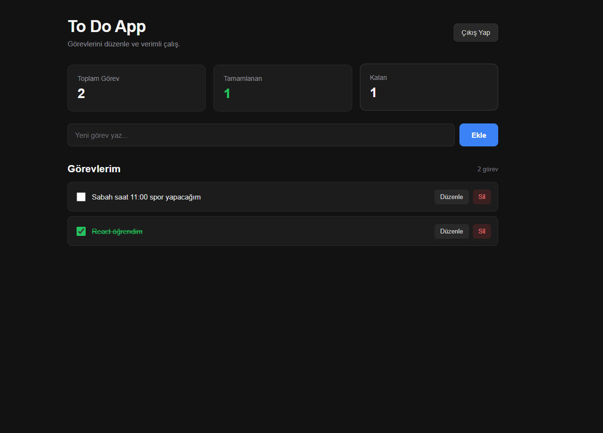

Tabii. 👍 README'yi biraz daha **GitHub'da profesyonel görünecek**, proje hakkında yeterli bilgi verecek şekilde hazırlayalım. Görselleri de doğrudan README içine ekleyelim.

`D:\GitHub\ToDoApp\README.md` dosyasının **tamamını silip** aşağıdakini koy:

````markdown
# 📝 To Do App

Modern ve kullanıcı bazlı bir görev yönetim uygulaması.

Bu proje, **React**, **Node.js / Express** ve **Microsoft SQL Server** kullanılarak geliştirilmiş full-stack bir To Do uygulamasıdır.

Kullanıcılar hesap oluşturabilir, giriş yapabilir ve kendi görevlerini oluşturup yönetebilir.

---

## 📸 Uygulama Görselleri

### 🔐 Login



---

### 📝 Register



---

### 🏠 Home



---

## 🚀 Özellikler

- 👤 Kullanıcı kayıt sistemi
- 🔐 Kullanıcı giriş sistemi
- 🔑 JWT Authentication
- 🔒 Protected Routes
- 🔐 bcrypt ile şifre hashleme
- 👥 Kullanıcıya özel görevler
- ➕ Görev ekleme
- 📋 Görev listeleme
- ✏️ Görev düzenleme
- ✅ Görev tamamlama / geri alma
- 🗑️ Görev silme
- 🔔 Toast bildirimleri
- 📊 Toplam / tamamlanan / kalan görev istatistikleri
- 💾 Microsoft SQL Server veritabanı
- 🔄 REST API
- 📱 Responsive arayüz

---

# 🛠️ Kullanılan Teknolojiler

## Frontend

- React
- React Router
- Vite
- JavaScript
- CSS
- Fetch API

## Backend

- Node.js
- Express.js
- JWT
- bcryptjs
- CORS
- dotenv
- mssql
- msnodesqlv8

## Database

- Microsoft SQL Server
- SQL Server Management Studio

---

# 🏗️ Proje Mimarisi

Uygulama üç ana bölümden oluşmaktadır:

```text
┌──────────────────────┐
│      React Client    │
│      Frontend        │
└──────────┬───────────┘
           │
           │ HTTP / REST API
           │
           ▼
┌──────────────────────┐
│   Node.js + Express  │
│       Backend        │
└──────────┬───────────┘
           │
           │ SQL Queries
           │
           ▼
┌──────────────────────┐
│    Microsoft SQL     │
│       Server         │
└──────────────────────┘
````

Authentication için JWT kullanılmaktadır.

```text
Register
   ↓
bcrypt Password Hash
   ↓
SQL Server
   ↓
Login
   ↓
JWT Token
   ↓
Protected API
```

---

# 📁 Proje Yapısı

```text
ToDoApp
│
├── client
│   │
│   ├── src
│   │   ├── components
│   │   │   ├── ProtectedRoute.jsx
│   │   │   └── Toast.jsx
│   │   │
│   │   ├── pages
│   │   │   ├── Home.jsx
│   │   │   ├── Login.jsx
│   │   │   ├── Register.jsx
│   │   │   ├── Home.css
│   │   │   ├── Login.css
│   │   │   └── Register.css
│   │   │
│   │   ├── App.jsx
│   │   └── main.jsx
│   │
│   ├── package.json
│   └── package-lock.json
│
├── server
│   │
│   ├── config
│   │   └── db.js
│   │
│   ├── controllers
│   │   ├── authController.js
│   │   └── taskController.js
│   │
│   ├── middleware
│   │   └── authMiddleware.js
│   │
│   ├── routes
│   │   ├── authRoutes.js
│   │   ├── taskRoutes.js
│   │   └── testRoutes.js
│   │
│   ├── .env.example
│   ├── package.json
│   ├── package-lock.json
│   └── server.js
│
├── database
│   └── Veri Taban kodu.txt
│
├── Home.png
├── Login.png
├── Register.png
├── Server komutları.txt
├── .gitignore
└── README.md
```

---

# 🔐 Authentication

Uygulamada kullanıcı doğrulama sistemi JWT kullanılarak gerçekleştirilmiştir.

### Register

Kullanıcı kayıt olduğunda:

```text
Kullanıcı
   ↓
React
   ↓
POST /api/auth/register
   ↓
Express
   ↓
bcrypt
   ↓
SQL Server
```

Şifre veritabanına düz metin olarak kaydedilmez.

Örneğin:

```text
123456
```

yerine bcrypt tarafından oluşturulan hash saklanır.

---

### Login

Kullanıcı giriş yaptığında:

```text
Email + Password
       ↓
POST /api/auth/login
       ↓
SQL Server
       ↓
bcrypt.compare()
       ↓
JWT Token
       ↓
React localStorage
```

JWT token, korumalı API isteklerinde kullanılır.

---

# 📋 Task API

Görev işlemleri REST API üzerinden gerçekleştirilmektedir.

| Method | Endpoint         | Açıklama                         |
| ------ | ---------------- | -------------------------------- |
| GET    | `/api/tasks`     | Kullanıcının görevlerini getirir |
| POST   | `/api/tasks`     | Yeni görev oluşturur             |
| PUT    | `/api/tasks/:id` | Görevi günceller                 |
| DELETE | `/api/tasks/:id` | Görevi siler                     |

Tüm task endpoint'leri JWT Authentication ile korunmaktadır.

---

# 👤 Kullanıcı Güvenliği

Her görev bir kullanıcıya bağlıdır.

Database ilişkisi:

```text
Users
  │
  │ 1
  │
  │
  │ *
  ▼
Tasks
```

Bir kullanıcı yalnızca kendi görevlerine erişebilir.

Örneğin:

```text
User ID: 1
   ├── Task 1
   ├── Task 2
   └── Task 3

User ID: 2
   ├── Task 4
   └── Task 5
```

User ID 1, User ID 2'nin görevlerini göremez.

---

# 🗄️ Database

Database olarak Microsoft SQL Server kullanılmıştır.

Database adı:

```text
ToDoAppDB
```

Tablolar:

```text
Users
Tasks
```

### Users

```text
Id
Name
Email
Password
CreatedAt
```

### Tasks

```text
Id
Title
Completed
UserId
CreatedAt
```

`Tasks.UserId` alanı `Users.Id` alanına foreign key ile bağlanmıştır.

Ayrıca kullanıcı silindiğinde ona bağlı görevler de `ON DELETE CASCADE` sayesinde silinir.

---

# ⚙️ Kurulum

## 1. Repository'yi klonla

```bash
git clone REPOSITORY_URL
```

Ardından proje klasörüne gir:

```bash
cd ToDoApp
```

---

## 2. Frontend bağımlılıklarını yükle

```bash
cd client
npm install
```

---

## 3. Backend bağımlılıklarını yükle

```bash
cd ../server
npm install
```

---

# 🗄️ 4. Database'i oluştur

Microsoft SQL Server Management Studio'yu aç.

Aşağıdaki dosyayı kullan:

```text
database/Veri Taban kodu.txt
```

Dosyadaki SQL komutlarını SQL Server üzerinde çalıştır.

Database:

```text
ToDoAppDB
```

oluşturulacaktır.

---

# 🔑 5. Environment Variables

`server` klasörü içerisinde `.env` dosyası oluştur.

`.env.example` dosyasını örnek olarak kullanabilirsin.

Örnek:

```env
JWT_SECRET=your_secret_key_here

DB_SERVER=YOUR_SQL_SERVER
DB_DATABASE=ToDoAppDB
```

> ⚠️ `.env` dosyası güvenlik nedeniyle GitHub repository'sine gönderilmemektedir.

---

# ▶️ 6. Backend'i çalıştır

Yeni bir terminal aç:

```bash
cd server
```

Ardından:

```bash
node server.js
```

Başarılı bağlantıda:

```text
Server http://localhost:5000 adresinde çalışıyor.
SQL Server bağlantısı başarılı!
```

mesajları görülür.

Backend:

```text
http://localhost:5000
```

adresinde çalışır.

---

# 💻 7. Frontend'i çalıştır

Yeni bir terminal aç:

```bash
cd client
```

Ardından:

```bash
npm run dev
```

Frontend:

```text
http://localhost:5173
```

adresinde çalışır.

---

# 🧪 API Testleri

API endpoint'leri Postman gibi API test araçlarıyla test edilebilir.

Örnek:

```text
GET
http://localhost:5000/api/tasks
```

Yeni görev:

```text
POST
http://localhost:5000/api/tasks
```

Güncelleme:

```text
PUT
http://localhost:5000/api/tasks/:id
```

Silme:

```text
DELETE
http://localhost:5000/api/tasks/:id
```

Korumalı endpoint'lerde:

```text
Authorization: Bearer TOKEN
```

kullanılır.

---

# 🔒 Güvenlik

Bu projede aşağıdaki güvenlik mekanizmaları uygulanmıştır:

* JWT Authentication
* bcrypt password hashing
* Protected Routes
* Kullanıcı bazlı task erişimi
* SQL Server foreign key ilişkileri
* `.env` ile gizli bilgilerin ayrılması
* `.gitignore` ile hassas dosyaların repository dışında tutulması

---


# 🎯 Projenin Amacı

Bu proje, modern bir full-stack web uygulamasının temel yapılarını öğrenmek ve uygulamak amacıyla geliştirilmiştir.

Projede özellikle aşağıdaki konularda pratik yapılmıştır:

* React component yapısı
* React Hooks
* React Router
* REST API
* Node.js
* Express.js
* JWT Authentication
* Password Hashing
* SQL Server
* CRUD işlemleri
* Frontend ↔ Backend iletişimi
* Database ilişkileri
* Protected API endpoints
* Git / GitHub proje yönetimi

---

# 🚀 Gelecekte Eklenebilecek Özellikler

Projeye ilerleyen aşamalarda aşağıdaki özellikler eklenebilir:

* [ ] Kullanıcı profil sayfası
* [ ] Şifre değiştirme
* [ ] Şifremi unuttum
* [ ] Görev kategorileri
* [ ] Görev önceliği
* [ ] Son teslim tarihi
* [ ] Görev arama
* [ ] Görev filtreleme
* [ ] Dark / Light Mode
* [ ] Pagination
* [ ] Dashboard
* [ ] Daha gelişmiş kullanıcı rolleri

---

# 👨‍💻 Geliştirici

**İbrahim Ömer Ğaşim**

Computer Programming
Gaziantep İslam Bilim ve Teknoloji Üniversitesi

---

⭐ Bu projeyi beğendiysen repository'ye yıldız bırakabilirsin.

